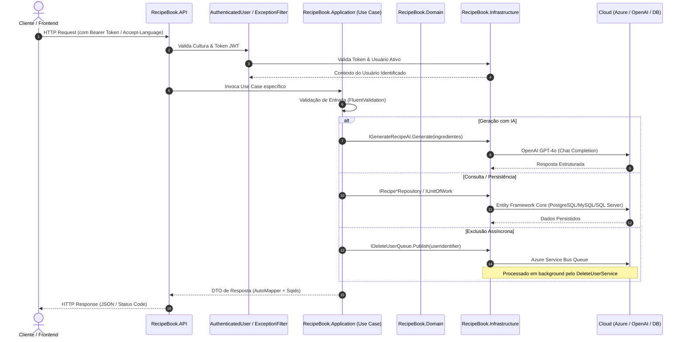

# 🍳 RecipeBook API (Livro de Receitas)

[](https://dotnet.microsoft.com/)
[](https://docs.microsoft.com/dotnet/csharp/)
[](#-arquitetura-e-system-design)
[](#-estratégia-de-testes)
[](Dockerfile)
[](#-inteligência-artificial-e-cloud)
[](#-inteligência-artificial-e-cloud)

Uma Web API robusta, escalável e moderna construída em **.NET 8** e **C# 12**, desenvolvida com base nos padrões **Clean Architecture**, **Domain-Driven Design (DDD)** e princípios **SOLID**. 

O **RecipeBook** oferece uma solução completa para gerenciamento de receitas culinárias, contando com geração inteligente de receitas por IA (**OpenAI GPT-4o**), armazenamento seguro de capas em nuvem (**Azure Blob Storage** com SAS tokens temporários), processamento assíncrono orientado a eventos (**Azure Service Bus**), autenticação híbrida (**JWT com Refresh Tokens** e **Google OAuth 2.0**), internacionalização dinâmica (**i18n**) e suporte intercambiável a múltiplos bancos de dados (**PostgreSQL**, **MySQL** e **SQL Server**).

---

## 📑 Sumário

- [Visão Geral e Funcionalidades](#-visão-geral-e-funcionalidades)
- [Arquitetura e System Design](#-arquitetura-e-system-design)
- [Design Patterns e Boas Práticas](#-design-patterns-e-boas-práticas)
- [Tecnologias e Bibliotecas](#-tecnologias-e-bibliotecas)
- [Estrutura da Solução](#-estrutura-da-solução)
- [Referência da API (Endpoints)](#-referência-da-api-endpoints)
- [Inteligência Artificial e Cloud](#-inteligência-artificial-e-cloud)
- [Estratégia de Testes](#-estratégia-de-testes)
- [Como Executar o Projeto](#-como-executar-o-projeto)
  - [Pré-requisitos](#pré-requisitos)
  - [Configuração de Ambiente](#configuração-de-ambiente)
  - [Executando a API](#executando-a-api)
  - [Executando com Docker](#executando-com-docker)
- [CI/CD e DevOps](#-cicd-e-devops)

---

## 🌟 Visão Geral e Funcionalidades

- **Gerenciamento Completo de Receitas**:
  - Cadastro, visualização detalhada, atualização e remoção de receitas.
  - Associação de múltiplos ingredientes, instruções passo a passo, tempos de preparo, níveis de dificuldade e categorias/tipos de pratos (*DishTypes*).
  - Filtro avançado de receitas com paginação por múltiplos critérios.
  - Dashboard consolidado do usuário com métricas e receitas recentes.
- **Geração de Receitas por IA**:
  - Geração automática de títulos, ingredientes complementares e passos estruturados utilizando **OpenAI GPT-4o**, a partir dos ingredientes que o usuário tem disponíveis.
- **Upload Seguro de Imagens de Capa**:
  - Upload e substituição de imagens de capa no **Azure Blob Storage** com isolamento por usuário.
  - Validação estrita de stream e tipos MIME válidos (*File.TypeChecker*).
  - Geração de URLs seguras efêmeras utilizando **SAS (Shared Access Signature)** com tempo de expiração controlado.
- **Autenticação e Autorização Híbrida**:
  - Autenticação própria com **JWT (JSON Web Tokens)** e suporte a renovação via **Refresh Tokens**.
  - Login Social integrado com **Google OAuth 2.0 (SSO)**.
  - Criptografia de senhas com algoritmo adaptativo **BCrypt**.
- **Ofuscação de Identificadores (Sqids)**:
  - IDs numéricos do banco de dados são ofuscados publicamente via **Sqids**, prevenindo enumeração maliciosa de registros (*IDOR mitigation*), com conversão transparente via *ModelBinder* e *ActionFilters*.
- **Exclusão de Conta Assíncrona e Orientada a Eventos**:
  - Solicitação de exclusão do usuário desacoplada via fila no **Azure Service Bus**.
  - Worker em segundo plano (*BackgroundService*) que consome o evento, remove recursivamente todos os dados e apaga os contêineres de blobs no Azure.
- **Internacionalização (i18n / l10n)**:
  - Middleware dinâmico baseado no cabeçalho `Accept-Language`, oferecendo mensagens de validação, erro e prompts em **Português (pt-BR e pt-PT)**, **Francês (fr)** e **Inglês (en)**.
- **Multi-Banco com Migrações Automáticas**:
  - Suporte comutável via configuração para **PostgreSQL**, **MySQL** e **SQL Server**.
  - Bootstrapping automático do banco (criação via Dapper/ADO.NET caso inexista) e controle de versão de schema via **FluentMigrator**.

---

## 🏛 Arquitetura e System Design

A aplicação implementa rigorosamente a **Clean Architecture**, isolando as regras de negócio de preocupações de infraestrutura e frameworks externos:

```
                    ┌──────────────────────────────────────────────┐
                    │              RecipeBook.API                  │
                    │   Controllers | Filters | Middlewares | BG   │
                    └──────────────────────┬───────────────────────┘
                                           │
                    ┌──────────────────────▼───────────────────────┐
                    │          RecipeBook.Application              │
                    │   Use Cases | FluentValidation | AutoMapper  │
                    └──────────────┬───────────────────────┬───────┘
                                   │                       │
                                   ▼                       ▼
                    ┌───────────────────────────┐   ┌───────────────────────────┐
                    │    RecipeBook.Domain      │   │ RecipeBook.Infrastructure │
                    │  Entities | Repository    │◄──┤  EF Core | Azure | OpenAI │
                    │ Interfaces | Value Objects│   │  FluentMigrator | BCrypt  │
                    └──────────────▲────────────┘   └───────────────────────────┘
                                   │
              ┌────────────────────┴────────────────────┐
              │                                         │
┌───────────────────────────┐             ┌───────────────────────────┐
│ RecipeBook.Communication  │             │   RecipeBook.Exceptions   │
│  Requests | Responses     │             │  Custom Exceptions | Resx │
└───────────────────────────┘             └───────────────────────────┘
```

### Fluxo de Dados e Interações de Sistema



---

## 🎯 Design Patterns e Boas Práticas

| Padrão / Princípio | Implementação no Projeto |
| :--- | :--- |
| **Clean Architecture** | Separação estrita em camadas concêntricas com inversão de dependência em direção ao Core (Domain). |
| **Interface Segregation (ISP)** | Repositórios segregados por intenção operacional: `IUserReadOnlyRepository`, `IUserWriteOnlyRepository`, `IUserUpdateOnlyRepository`, `IUserDeleteOnlyRepository`, etc. |
| **Unit of Work** | `IUnitOfWork` gerenciando atomicidade de transações entre múltiplos repositórios. |
| **Use Case / Command Pattern** | Cada funcionalidade da aplicação é encapsulada em um caso de uso único (`Execute`), garantindo o princípio da responsabilidade única (SRP). |
| **Event-Driven / Worker Service** | Desacoplamento de tarefas pesadas e sensíveis (como deleção total de conta e blobs) através de filas e `BackgroundService`. |
| **Fail-Fast Validation** | Uso do `FluentValidation` antes de executar qualquer lógica de negócio, retornando erros consolidados com códigos HTTP padronizados. |
| **Data Protection / ID Obfuscation** | Uso de **Sqids** para codificar chaves primárias numéricas sequenciais antes de expô-las em contratos de API ou rotas. |
| **Token-Based & Social Auth** | JWT com claims do usuário, expiração, renovação contínua via refresh tokens armazenados e autenticação delegada via Google OAuth 2.0. |
| **Ephemerality (Least Privilege)** | Geração de URLs para imagens de receitas protegidas por **SAS (Shared Access Signature)** temporárias no Azure Blob Storage. |
| **Resource-Based Localization** | Suporte multi-idioma nativo com arquivos `.resx` desacoplados por cultura. |

---

## 🛠 Tecnologias e Bibliotecas

### Core & Framework
- **[.NET 8.0 SDK](https://dotnet.microsoft.com/download/dotnet/8.0)** & **C# 12**
- **ASP.NET Core Web API**

### Persistência, Migrações e Acesso a Dados
- **[Entity Framework Core 8.0](https://learn.microsoft.com/ef/core/)**: ORM para mapeamento e manipulação de entidades.
- **[Npgsql.EntityFrameworkCore.PostgreSQL](https://www.npgsql.org/efcore/)**: Provedor oficial para PostgreSQL.
- **[Pomelo.EntityFrameworkCore.MySql](https://github.com/PomeloFoundation/Pomelo.EntityFrameworkCore.MySql)**: Provedor para MySQL.
- **[Microsoft.EntityFrameworkCore.SqlServer](https://learn.microsoft.com/ef/core/providers/sql-server/)**: Provedor para Microsoft SQL Server.
- **[FluentMigrator 5.2](https://fluentmigrator.github.io/)**: Versionamento e automação de migrações estruturais do banco.
- **[Dapper 2.1](https://github.com/DapperLib/Dapper)**: Micro-ORM utilizado na verificação e criação autônoma de bancos de dados.

### Segurança e Criptografia
- **[BCrypt.Net-Next](https://github.com/neoKushan/BCrypt.Net-Next)**: Hashing salteado e verificação segura de senhas.
- **[System.IdentityModel.Tokens.Jwt](https://www.nuget.org/packages/System.IdentityModel.Tokens.Jwt)**: Emissão e validação de tokens JWT.
- **[Microsoft.AspNetCore.Authentication.Google](https://www.nuget.org/packages/Microsoft.AspNetCore.Authentication.Google)**: Integração com Google Identity.
- **[Sqids](https://sqids.org/dotnet)**: Geração de IDs curtos e não previsíveis a partir de números inteiros.

### Cloud & Mensageria
- **[Azure.Storage.Blobs](https://github.com/Azure/azure-sdk-for-net/tree/main/sdk/storage/Azure.Storage.Blobs)**: Armazenamento em nuvem de imagens com criação dinâmica de contêineres e SAS.
- **[Azure.Messaging.ServiceBus](https://github.com/Azure/azure-sdk-for-net/tree/main/sdk/servicebus/Azure.Messaging.ServiceBus)**: Fila de mensagens para disparo e processamento assíncrono.
- **[OpenAI](https://github.com/OkGoDoIt/OpenAI-API-dotnet)**: Integração com a API da OpenAI utilizando o modelo GPT-4o.

### Produtividade e Utilitários
- **[AutoMapper 13.0](https://automapper.org/)**: Mapeamento declarativo entre DTOs e Entidades.
- **[FluentValidation 11.9](https://fluentvalidation.net/)**: Validação fluente e desacoplada de objetos de requisição.
- **[File.TypeChecker](https://github.com/mjf/FileTypeChecker)**: Identificação e validação de arquivos reais por assinatura de bytes (Magic Numbers).
- **[Swashbuckle.AspNetCore](https://github.com/domaindrivendev/Ahoy)**: Swagger UI com documentação de segurança JWT e formatação de tipos customizados.
- **[Microsoft.Extensions.Diagnostics.HealthChecks](https://learn.microsoft.com/aspnet/core/host-and-deploy/health-checks)**: Monitoramento de saúde com verificação de conectividade com o banco.

### Testes e Qualidade
- **[xUnit](https://xunit.net/)**: Framework principal de execução de testes.
- **[FluentAssertions](https://fluentassertions.com/)**: Asserções semânticas e legíveis.
- **[Moq](https://github.com/devlooped/moq)**: Mocking de interfaces e serviços externos.
- **[Bogus](https://github.com/bchavez/Bogus)**: Geração determinística de massas de dados realistas para testes.
- **[Microsoft.AspNetCore.Mvc.Testing](https://learn.microsoft.com/aspnet/core/test/integration-tests)**: Testes de integração end-to-end com WebApplicationFactory.

---

## 📂 Estrutura da Solução

```text
LivroReceitas/
├── src/
│   ├── Backend/
│   │   ├── RecipeBook.API/                # Camada de Apresentação (Controllers, Filters, Middlewares, BG Service)
│   │   │   ├── Attributes/                # Atributos de anotação de autorização
│   │   │   ├── BackgroundServices/        # Worker Service (DeleteUserService via Azure Service Bus)
│   │   │   ├── Binders/                   # Model Binder customizado para decodificar Sqids
│   │   │   ├── Controllers/               # Endpoints RESTful (Dashboard, Login, Recipe, Token, User)
│   │   │   ├── Converters/                # Conversores JSON customizados (UTC DateTime, Trim de String)
│   │   │   ├── Filters/                   # Action, Exception e Swagger Operation Filters
│   │   │   ├── Middlewares/               # Interceptadores HTTP (CultureMiddleware para i18n)
│   │   │   └── Token/                     # Resgate de token via HttpContext
│   │   │
│   │   ├── RecipeBook.Application/        # Camada de Casos de Uso e Regras de Negócio
│   │   │   ├── Extensions/                # Extensões utilitárias (Streams, Coleções)
│   │   │   ├── Services/                  # Configurações de AutoMapper e profiles
│   │   │   ├── SharedValidators/          # Validadores reaproveitáveis (Password, etc.)
│   │   │   └── UseCases/                  # Casos de uso segregados por agregado (Dashboard, Login, Recipe, Token, User)
│   │   │
│   │   ├── RecipeBook.Domain/             # Núcleo de Domínio (Pure C# - Zero dependências externas)
│   │   │   ├── Dtos/                      # Data Transfer Objects internos de domínio
│   │   │   ├── Entities/                  # Entidades (User, Recipe, Ingredient, Instruction, DishType, RefreshToken)
│   │   │   ├── Enums/                     # Enums de domínio (CookingTime, Difficulty, DishType, DatabaseType)
│   │   │   ├── Extensions/                # Extensões de conveniência de tipos primitivos
│   │   │   ├── Repositories/              # Interfaces segregadas de repositórios e IUnitOfWork
│   │   │   ├── Security/                  # Contratos de criptografia e manipuladores de tokens
│   │   │   ├── Services/                  # Contratos de integrações de domínio (OpenAI, Storage, Queues)
│   │   │   └── ValueObjects/              # Constantes de regras de negócio
│   │   │
│   │   └── RecipeBook.Infrastructure/     # Camada de Infraestrutura e Implementações Técnicas
│   │       ├── DataAccess/                # Contexto EF Core, conversores UTC e Repositórios
│   │       ├── Extensions/                # Extensões de configuração e leitura de appsettings
│   │       ├── Migrations/                # Migrações versionadas (FluentMigrator) e criação de banco
│   │       ├── Security/                  # Criptografia BCrypt/SHA512 e geradores JWT
│   │       └── Services/                  # Implementações de clientes Azure, OpenAI e Service Bus
│   │
│   └── Shared/
│       ├── RecipeBook.Communication/      # Contratos públicos (Requests, Responses, Enums)
│       └── RecipeBook.Exceptions/         # Exceções customizadas e recursos multi-idioma (.resx)
│
├── tests/
│   ├── CommonTestUtilities/               # Builders (Bogus), Mocks (Moq) e fixtures compartilhadas
│   ├── UseCases.Test/                     # Testes unitários dos casos de uso de negócio (33 testes)
│   ├── Validators.Test/                   # Testes unitários dos validadores FluentValidation (53 testes)
│   └── WebApi.Test/                       # Testes de integração end-to-end com WebApplicationFactory (87 testes)
│
├── Dockerfile                             # Build multi-etapa otimizado para produção
├── release-pipeline.yaml                  # Pipeline CI/CD do Azure DevOps
└── RecipeBook.sln                         # Arquivo de Solução Visual Studio / .NET
```

---

## 📡 Referência da API (Endpoints)

### 🔐 Autenticação & Tokens (`/login`, `/token`)
| Método | Endpoint | Protegido | Descrição |
| :--- | :--- | :---: | :--- |
| `POST` | `/login` | Não | Realiza login com e-mail e senha, retornando JWT e Refresh Token |
| `GET` | `/login/google` | Não | Autenticação via Google OAuth 2.0 (redireciona com token) |
| `POST` | `/token/refresh-token` | Não | Renova par de tokens a partir de um Refresh Token válido |

### 👤 Usuários (`/user`)
| Método | Endpoint | Protegido | Descrição |
| :--- | :--- | :---: | :--- |
| `POST` | `/user` | Não | Registra um novo usuário no sistema |
| `GET` | `/user` | Sim | Retorna os dados do perfil do usuário autenticado |
| `PUT` | `/user` | Sim | Atualiza dados cadastrais (nome, e-mail) |
| `PUT` | `/user/change-password` | Sim | Altera a senha do usuário com validação de senha atual |
| `DELETE` | `/user` | Sim | Solicita a exclusão da conta (publica mensagem no Service Bus) |

### 📊 Dashboard (`/dashboard`)
| Método | Endpoint | Protegido | Descrição |
| :--- | :--- | :---: | :--- |
| `GET` | `/dashboard` | Sim | Recupera resumo das receitas pertencentes ao usuário logado |

### 🍲 Receitas (`/recipe`)
| Método | Endpoint | Protegido | Descrição |
| :--- | :--- | :---: | :--- |
| `POST` | `/recipe` | Sim | Registra nova receita com ingredientes, passos e upload opcional de imagem |
| `POST` | `/recipe/filter` | Sim | Filtra receitas por título, ingredientes ou tipos de prato |
| `GET` | `/recipe/{id}` | Sim | Obtém detalhes completos de uma receita por ID ofuscado (*Sqids*) |
| `PUT` | `/recipe/{id}` | Sim | Atualiza dados de uma receita existente |
| `DELETE` | `/recipe/{id}` | Sim | Remove uma receita do usuário |
| `POST` | `/recipe/generate` | Sim | Gera sugestão de receita via OpenAI GPT-4o a partir de lista de ingredientes |
| `PATCH` | `/recipe/image/{id}` | Sim | Atualiza/adiciona imagem de capa para uma receita específica |

### 🩺 Monitoramento & Diagnóstico
| Método | Endpoint | Protegido | Descrição |
| :--- | :--- | :---: | :--- |
| `GET` | `/health` | Não | Health Check de integridade da API e conectividade com banco de dados |

> [!NOTE]
> Rotas protegidas exigem o cabeçalho `Authorization: Bearer <TOKEN_JWT>`. Todas as mensagens de resposta respeitam o idioma configurado no cabeçalho `Accept-Language` (`pt-BR`, `pt-PT`, `fr` ou fallback para `en`).

---

## 🤖 Inteligência Artificial e Cloud

### 1. Geração de Receitas com OpenAI GPT-4o
O caso de uso `GenerateRecipeUseCase` utiliza a integração `ChatGPTService` baseada no modelo `gpt-4o`. O serviço emprega *system prompts* otimizados e internacionalizados armazenados em recursos `.resx`, garantindo que a IA devolva receitas em formato delimitado e rigorosamente estruturado:
- Definição do tempo estimado baseado em enum.
- Lista de ingredientes informados e complementares inferidos.
- Passo a passo numerado e sequencial.

### 2. Armazenamento em Nuvem (Azure Blob Storage)
- **Multi-Tenant Storage**: Cada usuário tem seu próprio contêiner baseado em seu identificador único global (`UserIdentifier`).
- **Segurança com SAS**: A API nunca expõe o contêiner publicamente. URLs de acesso a imagens são geradas dinamicamente com tokens **SAS (Shared Access Signature)** e tempo de expiração curto (configurado em minutos).

### 3. Fila de Mensagens (Azure Service Bus)
- Ao solicitar o cancelamento da conta, a API publica uma mensagem na fila `user`.
- O worker `DeleteUserService` processa a mensagem de forma desacoplada, efetuando a limpeza dos contêineres de blobs, a exclusão dos registros no banco e a invalidação de tokens, prevenindo locks de requisições web síncronas.

---

## 🧪 Estratégia de Testes

A base de código possui **173 testes automatizados** distribuídos em diferentes níveis da pirâmide de testes:

```
          ┌───────────────────────────┐
          │     WebApi.Test (87)      │  -> Testes de Integração E2E (WebApplicationFactory)
          ├───────────────────────────┤
          │    UseCases.Test (33)     │  -> Testes Unitários de Casos de Uso (Moq + Bogus)
          ├───────────────────────────┤
          │   Validators.Test (53)    │  -> Testes Unitários de Validações (FluentValidation)
          └───────────────────────────┘
```

- **Unitários**:
  - `Validators.Test`: Garante cobertura exaustiva de regras de validação (tamanhos de campos, complexidade de senhas, formatos de e-mail, etc.).
  - `UseCases.Test`: Valida a orquestração e fluxos de negócio mockando dependências com **Moq** e gerando entidades consistentes com **Bogus**.
- **Integração**:
  - `WebApi.Test`: Utiliza `CustomWebApplicationFactory` para subir a aplicação em memória com EF Core In-Memory, testando endpoints reais, pipelines de autorização e testes parametrizados por cultura (`CultureInlineDataTest`).

Para executar toda a suíte de testes:
```bash
dotnet test
```

---

## 🚀 Como Executar o Projeto

### Pré-requisitos
- [.NET 8.0 SDK](https://dotnet.microsoft.com/download/dotnet/8.0)
- Um dos bancos de dados suportados (local ou via contêiner Docker):
  - **PostgreSQL** (padrão nas configurações de desenvolvimento)
  - **MySQL 8.x**
  - **SQL Server 2019+**
- (Opcional) Conta Azure (Blob Storage / Service Bus) e chave OpenAI.

### Configuração de Ambiente

As configurações principais encontram-se em `src/Backend/RecipeBook.API/appsettings.Development.json`. Para alternar entre os bancos de dados, altere a propriedade `DatabaseType`:
- `"1"`: PostgreSQL
- `"2"`: MySQL
- `"3"`: SQL Server

```json
{
  "ConnectionStrings": {
    "DatabaseType": "1",
    "ConnectionPostgreSQL": "Server=localhost;Port=5432;Database=livroreceitas;User Id=postgres;Password=root;",
    "ConnectionMySql": "Server=localhost;Database=livroreceitas;Uid=root;Password=root;",
    "ConnectionSqlServer": "Data Source=localhost,1433;Initial Catalog=livroreceitas;User Id=sa;Password=SenhaForte!;TrustServerCertificate=True;"
  },
  "Settings": {
    "Password": {
      "AdditionalKey": "ChaveDeAdicionalDeSegurancaParaSalt"
    },
    "Jwt": {
      "SigningKey": "ChavePrivadaSuperSecretaComTamanhoSuficiente1234567890",
      "ExpirationTimeMinutes": 480
    },
    "IdCryptographyAlphabet": "T5b6rWA7MH3pwUEXVYK8FG4RyeiszQkox9ljmatdun2CqO1cJPhIDvZLSgNf0B"
  }
}
```

Para segredos de nuvem e APIs externas em ambiente de desenvolvimento, utilize **.NET User Secrets**:
```bash
cd src/Backend/RecipeBook.API
dotnet user-secrets set "Settings:OpenAI:ApiKey" "sk-sua-chave-openai"
dotnet user-secrets set "Settings:BlobStorage:Azure" "sua-connection-string-azure-storage"
dotnet user-secrets set "Settings:ServiceBus:DeleteUserAccount" "sua-connection-string-service-bus"
dotnet user-secrets set "Settings:Google:ClientId" "seu-google-client-id"
dotnet user-secrets set "Settings:Google:ClientSecret" "seu-google-client-secret"
```

> [!TIP]
> **Migrações Automáticas**: Ao iniciar a API, ela automaticamente verifica se o banco de dados especificado existe. Se não existir, ele é criado automaticamente e as migrações do **FluentMigrator** são aplicadas na inicialização.

### Executando a API

Restaure os pacotes e inicialize o servidor web:
```bash
dotnet restore
dotnet run --project src/Backend/RecipeBook.API
```

Acesse a documentação interativa do Swagger em:
`http://localhost:5000/swagger` ou `https://localhost:7000/swagger` (conforme portas alocadas no `launchSettings.json`).

### Executando com Docker

Você pode compilar e rodar a aplicação em contêiner utilizando o `Dockerfile` multi-stage:

```bash
# Build da imagem Docker
docker build -t recipebook-api .

# Execução do contêiner expondo a porta 8080
docker run -d -p 8080:8080 --name recipebook-api-instance recipebook-api
```

A aplicação estará disponível em `http://localhost:8080`.

---

## 📦 CI/CD e DevOps

O repositório inclui um arquivo de automação `release-pipeline.yaml` configurado para **Azure Pipelines**:
1. Acionado automaticamente em alterações na branch `main`.
2. Resgata com segurança arquivos de configuração de produção (`appsettings.Production.json`).
3. Compila a imagem Docker a partir do `Dockerfile` multi-stage.
4. Publica a imagem no repositório **Azure Container Registry (ACR)** (`apirecipebook.azurecr.io`) tagueada com `latest` e com o ID da respectiva build.

---

## 📄 Licença

Este projeto é desenvolvido para fins de demonstração arquitetural e portfólio. 